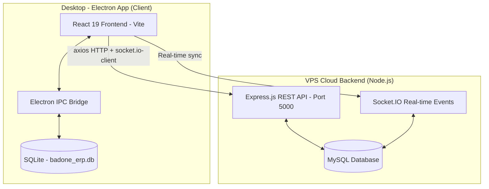

# BADONE RTO & INSURANCE ERP

> **Enterprise Dealership Operations & Financial Ledger Suite**  
> Custom built for **Badone Motors** to manage customer master entries, RTO processing, insurance differences, agent commissions, and multi-tier dealer ledger networks (Main Dealer, ASCs, and FO Points).

**Version:** `2.0.1` | **Author:** Badone Motors | **Platform:** Windows (Desktop) + VPS (Cloud Backend)

---

## System Architecture

The application is a **Hybrid Architecture** — a native **Electron desktop app** (for offline use) connected to a **Node.js VPS Cloud Backend** for real-time multi-PC synchronization via Socket.IO.



---

## Project Structure

```
badone-erp/
|
+-- electron/                    # Electron Main Process (Desktop)
|   +-- database.js             # SQLite WAL schema, table definitions, indexes
|   +-- ipcHandlers.js          # IPC logic: ledger posting, completions, reports
|   +-- main.js                 # Electron window, lifecycle, backup engine
|   +-- preload.js              # Context bridge -> window.api (secure IPC)
|
+-- src/                        # React Frontend (Vite)
|   +-- assets/                 # Icons, fonts, static media
|   +-- components/             # Reusable UI: Navigation, Modals, Export widgets
|   +-- context/                # React Context providers
|   +-- pages/
|   |   +-- Dashboard.jsx       # Metrics grid (5 columns)
|   |   +-- MasterEntry.jsx     # Customer registration form
|   |   +-- Insurance.jsx       # Insurance tracking, status, document upload
|   |   +-- RTO.jsx             # RTO registration feeds & documents
|   |   +-- DealerLedger.jsx    # Network payments & ledger grid
|   |   +-- Commission.jsx      # Agent commission tracking (Teerth & Vasu)
|   |   +-- Network.jsx         # Dealer profile hub
|   |   +-- Reports.jsx         # Export reports (PDF/Excel)
|   |   +-- Settings.jsx        # Backup, restore, and system settings
|   +-- utils/
|   |   +-- export.js           # jsPDF, jsPDF-autotable, SheetJS (XLSX) wrappers
|   +-- App.jsx                 # Main layout, state, and page router
|   +-- index.css               # Premium CSS: HSL vars, glassmorphism, animations
|   +-- main.jsx                # React DOM entry point
|
+-- server/                     # VPS Cloud Backend (Node.js + Express)
|   +-- server.js               # Express app, Socket.IO, rate limiter, helmet
|   +-- config/
|   |   +-- db.js               # MySQL connection & DB initialization
|   +-- routes/
|   |   +-- api.js              # All REST API route definitions
|   +-- controllers/            # Request handlers per module
|   +-- middleware/             # Auth, error handling middleware
|   +-- services/
|   |   +-- socketService.js    # Socket.IO real-time event handlers
|   +-- uploads/                # Uploaded documents storage
|   +-- exports/                # Generated export files (PDF, Excel)
|   +-- backups/                # Database backup files
|
+-- public/                     # Static assets (icon.png etc.)
+-- dist/                       # Built Electron app output
+-- Start_Badone_ERP.bat        # One-click launcher script (Windows)
+-- ecosystem.config.js         # PM2 process manager config (VPS)
+-- nginx.conf                  # Nginx reverse proxy config (VPS)
+-- vite.config.js              # Vite React dev server (Port 5179)
+-- package.json                # Electron-Builder manifest & dependencies
+-- .env                        # Environment variables (VPS URL, ports)
```

---

## Database Schema (SQLite - Desktop)

The Electron desktop app uses **SQLite** with `better-sqlite3` driver in **WAL mode** for high-speed concurrent operations.

### Tables Overview

| Table | Description |
|---|---|
| `settings` | App configuration, company info, machine ID |
| `network_locations` | Dealer/ASC/FO profiles and status |
| `master_entries` | Customer vehicle records (invoice, frame, engine) |
| `insurance_details` | Policy info, price list vs actual deducted |
| `rto_details` | Registration number, RTO fees, differences |
| `agent_commissions` | Commission tracking for Teerth & Vasu |
| `dealer_payment_ledgers` | Current outstanding balance per dealer/dept |
| `dealer_transactions` | Full transaction history with running balance |
| `dealer_monthly_balances` | Month-wise opening/closing balance snapshots |
| `backup_history` | Auto-backup log |

---

## Multi-Tier Ledger Logic

Network locations are classified into three types:
1. **Main Dealer** - Internal showroom accounts, self-hosted RTO/Insurance entries
2. **ASC Dealers** - Authorized Service Centers
3. **FO Points** - Franchise Outlet Points

### Key Accounting Algorithms

- **Insurance Ledger Entry**: Triggered when status = `Completed`. Debit = `insurance_price_list`. Commission tracked via `insurance_difference`.
- **RTO Ledger Entry**: Triggered when status = `Completed`. Debit = `rto_price_list` (covers registration, feeding charges, operational costs).
- **Payment Deposit**: Via *Receive Dealer Payment Modal*. Credits decrease `running_balance`.

---

## Developer Operations

### Prerequisites

| Requirement | Version |
|---|---|
| Node.js | v18 or higher |
| npm | Comes with Node.js |
| C++ Build Tools | Required for `better-sqlite3` on Windows |
| MySQL | Required for VPS backend |

---

### Desktop App (Electron)

#### Install Dependencies
```bash
npm install
```

#### Run in Development Mode
Starts Vite dev server (port 5179) + Electron simultaneously:
```bash
npm run electron:dev
```

#### Lint Check
```bash
npm run lint
```

#### Build Executable (Windows)
Compiles frontend + packages as Windows .exe installer using electron-builder:
```bash
npm run electron:build
```

Output files inside `/dist` directory:
- `Badone-RTO-Insurance-ERP-Setup.exe` - NSIS Installer
- `Badone-RTO-Insurance-ERP-Portable.exe` - Portable executable

---

### VPS Cloud Backend (server/)

#### Install Server Dependencies
```bash
cd server
npm install
```

#### Configure Environment
Edit `server/.env`:
```
PORT=5000
DB_HOST=localhost
DB_USER=your_mysql_user
DB_PASSWORD=your_mysql_password
DB_NAME=badone_erp
```

#### Start Backend Server
```bash
node server.js
```

#### Start with PM2 (Production - Recommended)
```bash
pm2 start ecosystem.config.js
pm2 save
pm2 startup
```

#### Check Server Status
```bash
pm2 status
pm2 logs badone-erp-server
```

---

## VPS Deployment (Nginx + PM2)

The VPS backend runs behind **Nginx** as a reverse proxy on port 5000.

### Quick Setup
```bash
# 1. Copy nginx.conf to sites-available
sudo cp nginx.conf /etc/nginx/sites-available/badone-erp

# 2. Enable site
sudo ln -s /etc/nginx/sites-available/badone-erp /etc/nginx/sites-enabled/

# 3. Reload nginx
sudo nginx -t && sudo systemctl reload nginx

# 4. Start with PM2
pm2 start ecosystem.config.js
```

See VPS_DEPLOYMENT_INSTRUCTIONS.md for full step-by-step guide.

---

## Data Backup & Restoration

| Type | Description |
|---|---|
| **Auto-Backup** | Triggered on significant transactions; snapshot saved to local storage |
| **Manual Restore** | Via Settings Desk - import external .db file securely |

The app handles SQLite lock prevention and closes all DB connections atomically before overwriting.

---

## Key Dependencies

| Package | Purpose |
|---|---|
| `electron` v34 | Desktop app shell |
| `react` v19 | Frontend UI framework |
| `vite` v8 | Frontend build tool & dev server |
| `better-sqlite3` | High-performance SQLite driver (desktop) |
| `socket.io` | Real-time multi-PC sync |
| `express` | VPS REST API server |
| `electron-builder` | Windows .exe packaging |
| `jspdf` + `xlsx` | PDF & Excel export |
| `recharts` | Dashboard charts & graphs |
| `lucide-react` | Icon library |

---

## Quick Commands Reference

```bash
# Development
npm run electron:dev          # Start desktop app in dev mode

# Build
npm run electron:build        # Build Windows .exe installer

# VPS Backend
cd server && node server.js   # Start VPS server manually
pm2 start ecosystem.config.js # Start with PM2 (production)

# Utilities
npm run lint                  # Run ESLint checks
```

---

*Copyright 2026 Badone Motors. All rights reserved.*
