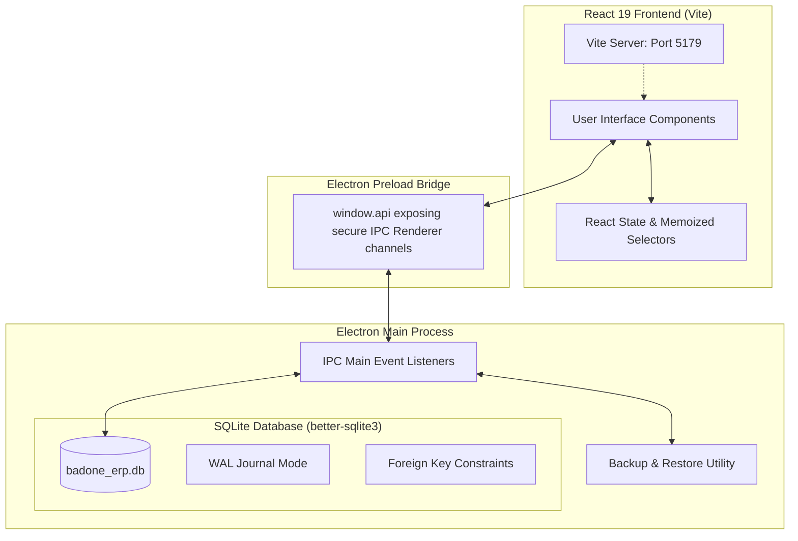
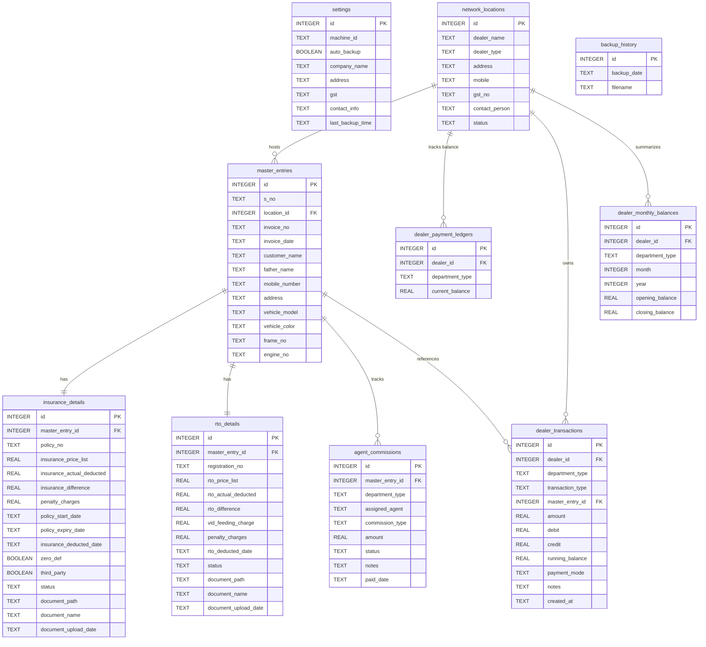
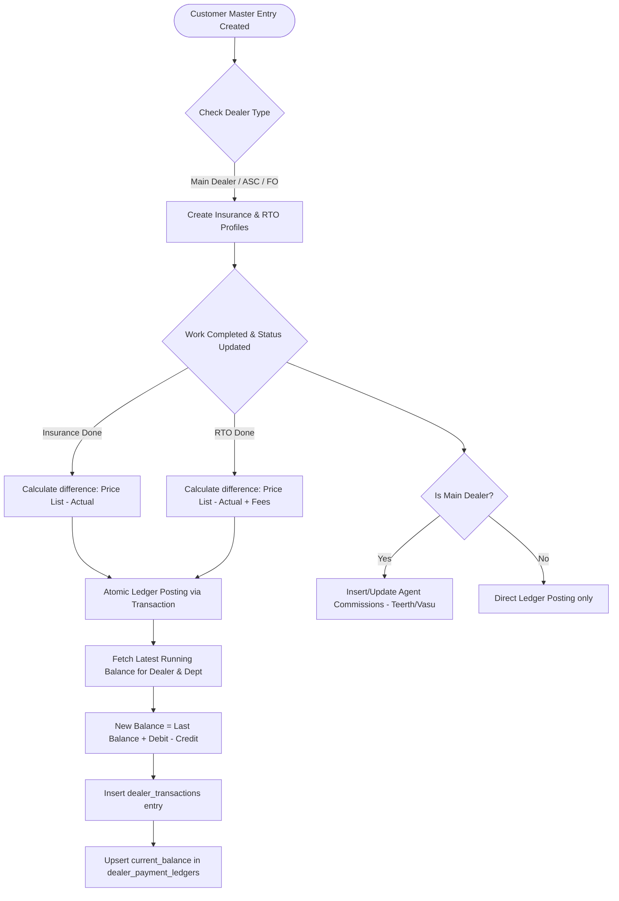

# BADONE RTO & INSURANCE ERP

> **Enterprise Dealership Operations & Financial Ledger Suite**  
> Custom built for **Badone Motors** to manage customer master entries, RTO processing, insurance differences, agent commissions, and multi-tier dealer ledger networks (Main Dealer, ASCs, and FO Points).

---

## 🏛️ System Architecture

The application is built on a high-performance **Electron + Vite + React** hybrid architecture, delivering a native desktop performance combined with a premium, responsive user interface.



---

## 🗄️ Database Schema & Data Model

The backend runs an optimized **SQLite** engine utilizing the `better-sqlite3` driver. The engine operates in **Write-Ahead Logging (WAL)** mode for concurrent high-speed operations and enforces strict **Foreign Key Constraints** for data integrity.

### Entity Relationship Diagram


---

## Unified Multi-Tier Ledger Rules

The ERP handles both internal and external operations using a unified bookkeeping method. Network locations are classified into three types:
1. **Main Dealer** (Internal accounts, showroom insurance, self-hosted RTO entries)
2. **ASC Dealers** (Authorized Service Centers)
3. **FO Points** (Franchise Outlets)

### Ledger Posting Flow Chart


### Key Accounting Algorithms
* **Insurance Ledger Entry**: Triggered when status is set to `Completed`. The `insurance_price_list` amount represents the outstanding bill (debit) charged to the dealer, while `insurance_difference` handles commissions.
* **RTO Ledger Entry**: Triggered when status is set to `Completed`. The RTO debit is computed as `rto_price_list` (which already covers registrations, feeding charges, and standard operational costs).
* **Payment Deposit / Adjustment**: Handled via the *Receive Dealer Payment Modal*. Adjustments decrease the outstanding debit (`running_balance` decreases by the credit amount).

---

## 📦 Directory Tree Layout

```
badone-erp/
├── electron/
│   ├── database.js          # SQLite WAL schema, table definitions, and indexes
│   ├── ipcHandlers.js       # Main process IPC logic (completions, ledger posting, reports)
│   ├── main.js              # Electron window instantiation, lifecycle, and backup engines
│   └── preload.js           # Context bridge exposing secure channels to window.api
├── src/
│   ├── assets/              # Icons, styling tokens, and static media
│   ├── components/          # Reusable UI elements (Navigation, Modals, Export Widgets)
│   ├── pages/
│   │   ├── Dashboard.jsx    # Unified dashboard metrics grid (5 columns)
│   │   ├── MasterEntry.jsx  # Customer Processing Desk (Customer registration form)
│   │   ├── Insurance.jsx    # Insurance tracking, status toggles, document uploaders
│   │   ├── RTO.jsx          # RTO desk tracking registration feeds & documents
│   │   ├── DealerLedger.jsx # Network Payments Overview, Ledger grids & Payment receiving
│   │   ├── Commission.jsx   # Teerth & Vasu Agent Commission lists and synchronization
│   │   ├── Network.jsx      # Dealer profile registration hub
│   │   ├── Reports.jsx      # Departmental reporting export deck
│   │   └── Settings.jsx     # Backup and restoration tools
│   ├── utils/
│   │   └── export.js        # jsPDF, jsPDF-autotable, and SheetJS (XLSX) wrappers
│   ├── App.jsx              # Main React layout, state control, and page router
│   ├── index.css            # Premium custom CSS stylesheets, HSL vars, animations
│   └── main.jsx             # React DOM loader
├── package.json             # Manifest file containing Electron-Builder & dependency definitions
└── vite.config.js           # Vite React 19 dev server options (Port 5179)
```

---

## 🚀 Developer Operations & Build Guides

### Prerequisites
* **Node.js** (v18 or higher recommended)
* **npm** (comes bundled with Node.js)
* **C++ Build Tools** (Required on Windows to compile native bindings for `better-sqlite3`)

### 1. Installation
Clone the repository and install all dependencies:
```bash
npm install
```

### 2. Run in Development Mode
Launch the Vite asset dev server (port 5179) and Electron simultaneously:
```bash
npm run electron:dev
```

### 3. Linting Checks
To run the ESLint analyzer across modified workspace components:
```bash
npm run lint
```

### 4. Compiling & Packaging (Portable Windows Build)
To compile frontend bundles and package the entire ERP as a single, portable Windows executable installer using `electron-builder`:
```bash
npm run electron:build
```
Once complete, the built executable installer will be available inside the `/dist_electron` directory.

---

## 🛡️ Data Backup & Restoration Policy

The system implements a dual-safety backup layout:
1. **Auto-Backup Trigger**: Whenever a significant transaction occurs or the database is loaded, an automatic snapshot is saved to local storage.
2. **Manual Restore Hub**: Located in the *Settings Desk*. Allows importing external database backup files (`.db`) securely. The application handles SQLite lock prevention and database connection closures atomic-style before overwriting the file.
